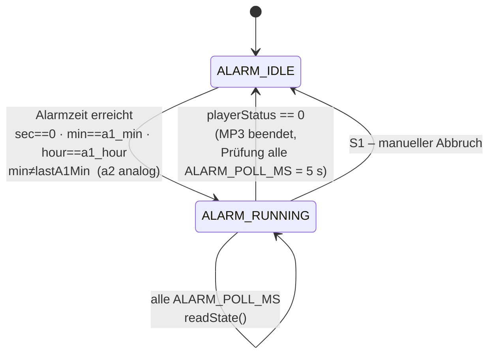
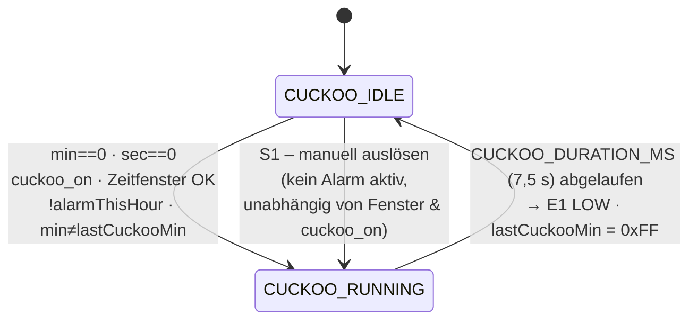
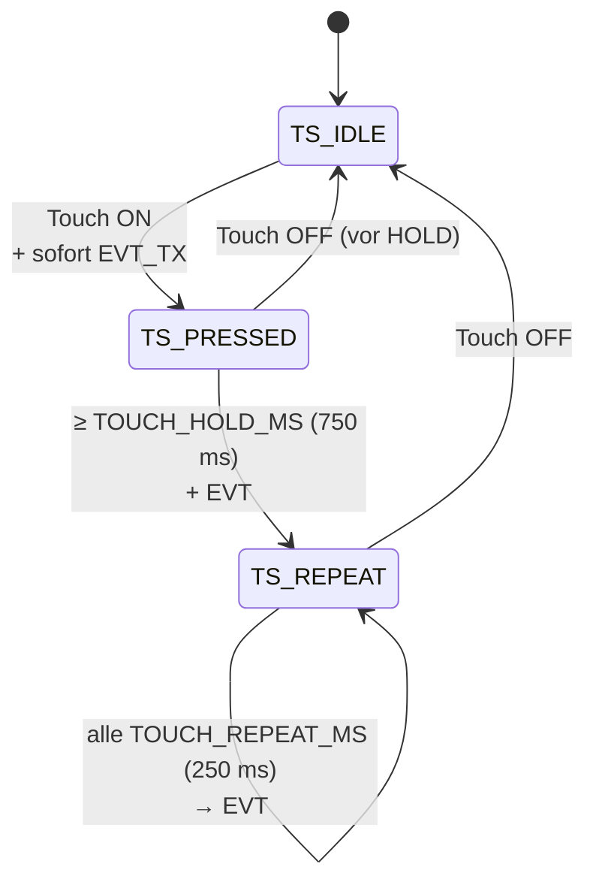
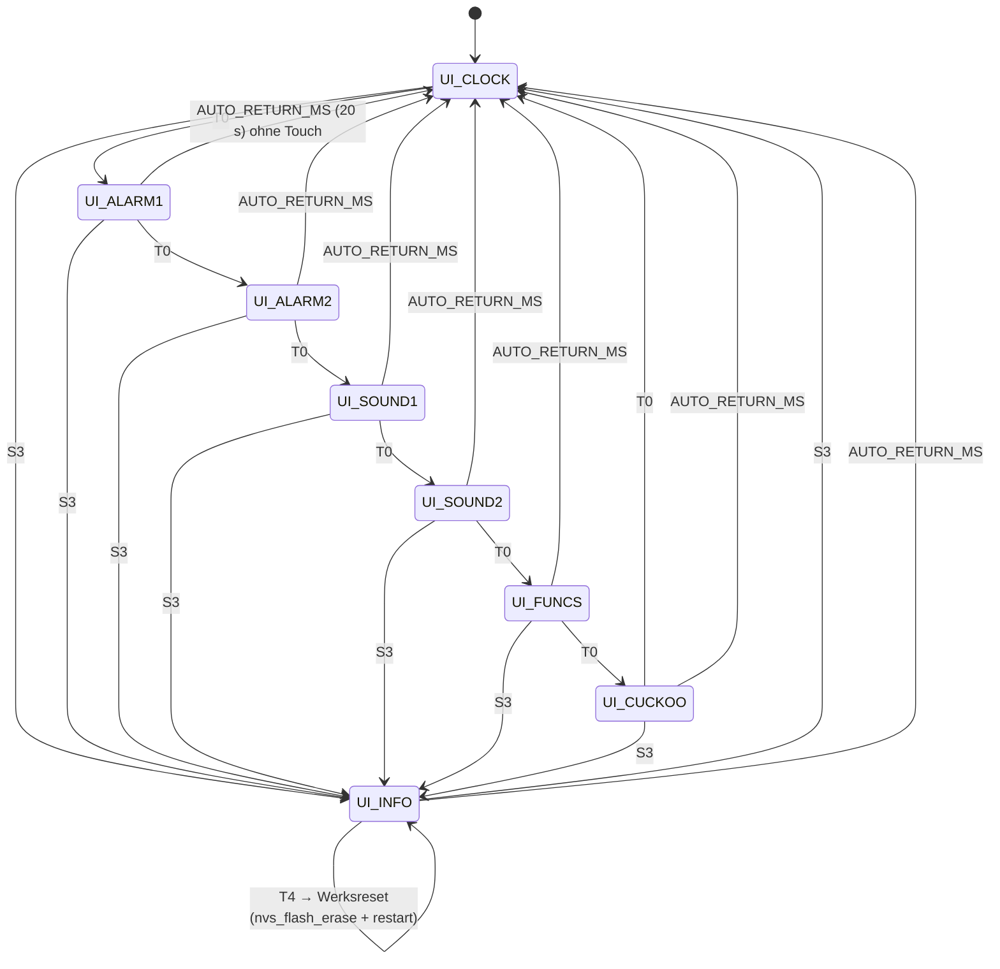

# bTn Wecker – State Machines

*Firmware 11v00 · Mermaid-Diagramme (aus `bTn_Wecker_StateMachines.pptx`)*

---

## 1. Alarm-State-Machine

*alarmTask (Core 0, Pri 2) · Takt 500 ms*

**Bedingungen**

- **IDLE → RUNNING:** `a1_on && sec==0 && min==a1_min && hour==a1_hour && min != lastA1Min` (Minuten-Sperre); Alarm 2 analog.
- **RUNNING → IDLE:** nach `ALARM_POLL_MS` (5 s) → `playerStatus == 0` (MP3 beendet).
- **Alarm 1 Vorrang:** Alarm 2 wird nur per `else if` geprüft → Alarm 1 hat Vorrang bei gleicher Zeit.
- **playerMutex:** schützt `playFolder()` und `readState()`. `vTaskDelay(1 ms)` liegt AUSSERHALB des Mutex (Projektregel).
- **playerStatus:** `== 0` (seit 9v4, war vorher `< 1`) – verhindert Fehlabbruch bei `readState()`-Timeout (UART-Konflikt mit `webLogTask`).

---

## 2. Kuckuck-State-Machine

*alarmTask (Core 0, Pri 2) · Takt 500 ms*

**Bedingungen**

- **Zeitfenster-Prüfung:** normal `cuckoo_onTime ≤ hour ≤ cuckoo_offTime`. Bei Mitternacht-Überlauf (z. B. 22–06): `hour ≥ onTime || hour ≤ offTime`.
- **alarmThisHour:** `(a1_on && a1_min==0 && hour==a1_hour) || (a2_on && a2_min==0 && hour==a2_hour)` → Kuckuck unterdrückt.
- **Minuten-Sperre:** `lastCuckooMin` wird auf `t_min` gesetzt und erst beim Übergang `RUNNING → IDLE` wieder auf `0xFF` zurückgesetzt.

---

## 3. Touch-State-Machine

*touchTask (Core 0, Pri 2) · Takt TOUCH_POLL_MS (50 ms)*

**Bedingungen**

- **Schwellwert:** `padWert < (baseline − TOUCH_DROP)` → Touch erkannt. Fallback wenn `baseline < TOUCH_DROP`: 80 % der Baseline.
- **Exklusivität:** sobald ein Pad aktiv ist (`TS_PRESSED` / `TS_REPEAT`), werden alle anderen Pads ignoriert. Baseline-Rekalibrierung alle 10 min im `TS_IDLE`.
- **ISR-Debouncing Stufe 1:** Flanken < `BTN_DEBOUNCE_MS` (30 ms) werden in der ISR verworfen → saubere Queue.
- **ISR-Debouncing Stufe 2:** `inputTask` – `BTN_LOCKOUT_MS` (1000 ms) Aktionssperre.

---

## 4. UI-State-Machine

*inputTask (Core 1, Pri 2) + displayTask (Core 1, Pri 1)*

**Seiten-Zuordnung**

| State | Seite | T2/T3/T4-Funktion |
|---|---|---|
| UI_CLOCK  | 0 | onClock – Vol± |
| UI_ALARM1 | 1 | onAlarm1 – Ein/Aus, h+, min+ |
| UI_ALARM2 | 2 | onAlarm2 – analog Alarm 1 |
| UI_SOUND1 | 3 | onSound1 – Vorschau, Datei± |
| UI_SOUND2 | 4 | onSound2 – analog Sound 1 |
| UI_FUNCS  | 5 | onFuncs – Kuckuck/Licht/Mühlrad |
| UI_CUCKOO | 6 | onCuckooTime – von/bis |
| UI_INFO   | – | onInfo – WiFi-Konfigurator / Werksreset |

**Globale Übergänge**

- **Auto-Rückkehr:** nach `AUTO_RETURN_MS` (20 s) ohne Touch von jeder Seite ≠ `UI_CLOCK` zurück zu `UI_CLOCK`.
- **Display-Timeout:** OLED schaltet nach `DISPLAY_TIMEOUT_MS` (5 min) ohne Touch ab (10v00/10v02). Jeder Touch weckt das Display, das auslösende Event wird verworfen. Alarm-Start weckt zusätzlich per `wakeDisplay()` (10v03).

---

*bTn Wecker · State Machines · Firmware 11v00*
